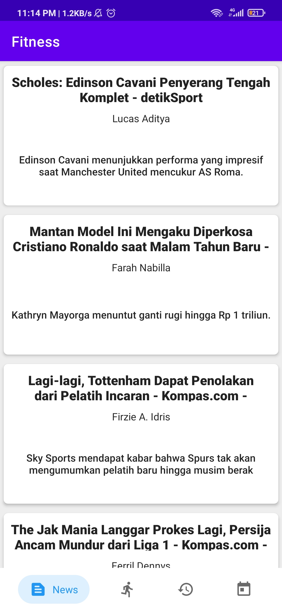
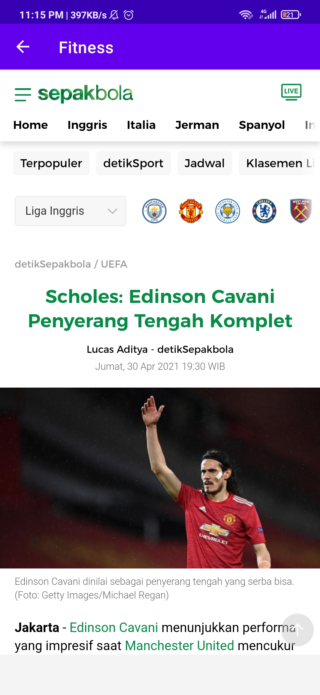
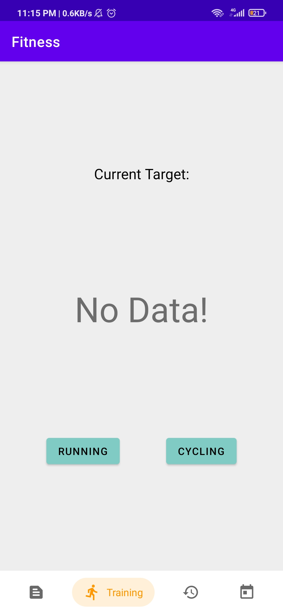

# Fitness Android Application!

## Deskripsi Aplikasi

<!-- Buat Gambar Title -->

**Fitness Android Application** merupakan sebuah aplikasi android yang dapat menunjang kegiatan _workout_ yang berisi beberapa fitur seperti *Sport News*, *Training Tracker*, *Training History*, dan *Training Scheduler*.

## Cara Kerja Aplikasi

Project dapat dibuka dengan Android Studio dan melakukan beberapa *setup sync* dan kemudian melakukan *build project*:

| Spesifikasi | Penjelasan |
| --- | --- |
| Sport News API | Sport News API diambil melalui URL yang ada pada [news-api](https://newsapi.org/s/indonesia-sports-news-api) kemudian di *fetch* dengan Retrofit dan dimasukkan ke dalam RecyclerView News, data tersebut dimasukkan menggunakan *adapter*. Lalu, setiap *item* dibuat *listener* yang jika dilakukan *click* akan membuka sebuah *webview* dari URL berita tersebut. Selain itu dilakukan juga pengandalan landscape, agar *column* berita menjadi 2|
| Compass | Compass dibuat dengan mengacu pada referensi yang ada pada library, dengan kemudian ditaruh pada pojok kanan Maps |
| Halaman Log Detail | Halaman Log Detail dibuat dengan membuat fragment untuk Log Detail kemudian dibuat *listener* untuk setiap log info yang jika dilakukan *click* pada *item* maka akan membuka *detail* dari log tersebut |
| …  | ... |

## Library yang digunakan

Berikut adalah beberapa *library/assets* yang kami gunakan, beserta justifikasi pemakainnya:

- [Chip NavBar](https://github.com/ismaeldivita/chip-navigation-bar)
- Retrofit
- [Compass](https://github.com/iutinvg/compass)
- Material Design
- Lifeccyle ViewModel
- Room
- Coroutines
- Kotlin-extensions
- Google Maps Location Service
- Dagger
- Easy Permission
- Timber

## Screenshot Aplikasi

### News:

### Training Tracker:

### Pembagian Kerja

- Muhammad Hasan (13518012)
    - Fetch API News
    - Membuat Recycler News
    - Membuat GridView Landscape News
    - Membuat Compass
    - Membuat Halaman Log Detail
- Hafshy Yazid Albisthami (13518051)
    - Pembuatan Navbar dan template fragmentnya
    - Fitur Training Tracker (Cycling dan Running)
    - Membantu pembuatan Database
- Jonathan Yudi Gunawan (13518084)
    - Membuat Calendar History
    - Membuat History Log
    - Setup Database Room
    - Membuat List Schedule
    - Membuat Notifikasi Schedule

