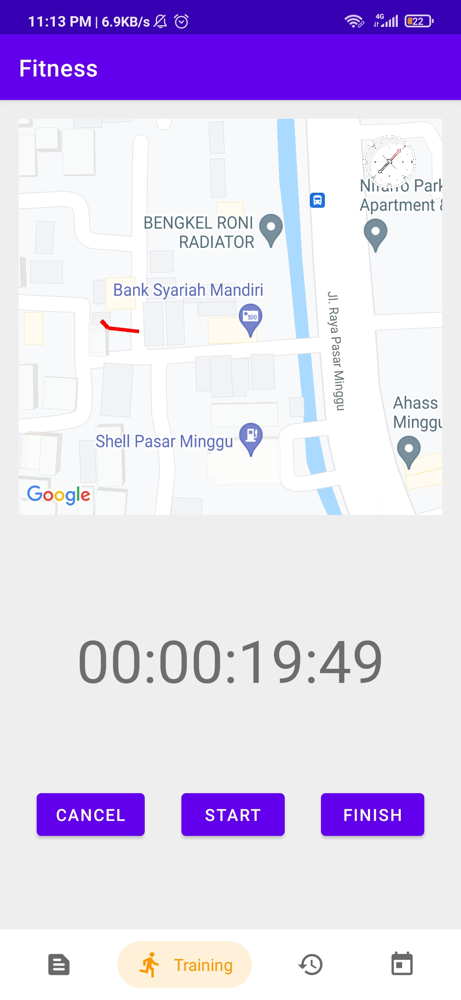

# Fitness Android Application!

## Deskripsi Aplikasi

<!-- Buat Gambar Title -->

**Fitness Android Application** merupakan sebuah aplikasi android yang dapat menunjang kegiatan _workout_ yang berisi beberapa fitur seperti *Sport News*, *Training Tracker*, *Training History*, dan *Training Scheduler*.

## Cara Kerja Aplikasi

Project dapat dibuka dengan Android Studio dan melakukan beberapa *setup sync* dan kemudian melakukan *build project*:

| Spesifikasi | Penjelasan |
| --- | --- |
| Sport News API | Sport News API diambil melalui URL yang ada pada [news-api](https://newsapi.org/s/indonesia-sports-news-api) kemudian di *fetch* dengan Retrofit dan dimasukkan ke dalam RecyclerView News, data tersebut dimasukkan menggunakan *adapter*. Lalu, setiap *item* dibuat *listener* yang jika dilakukan *click* akan membuka sebuah *webview* dari URL berita tersebut. Selain itu dilakukan juga pengandalan landscape, agar *column* berita menjadi 2|
| Halaman Training History | Menggunaan CalendarView dengan men-set `onDateChangedListener`, kemudian melakukan fetch data dari room sesuai tanggal yang dipilih dan menampilkan daftar training yang pernah dilakukan di bawah kalender. Masing-masing item diberi `onClickListener` yang akan berpindah ke halaman log detail |
| Training Scheduler | Scheduler menggunakan AlarmManager untuk melakukan repeating task. Fungsi yang digunakan adalah `setRepeating`. Data schedule kemudian disimpan pada Room. Ketika intent schedule diterima oleh class `AlarmReceiver`, maka akan diproses berdasarkan variabel yang dipassing dengan menggunakan fungsi `putExtra` pada intent tersebut. Misal, bila notifikasi untuk start training, maka teks nya akan berbeda dengan stop training. Bila user menginginkan run di background secara otomatis, maka service `TrackingService` akan dijalankan secara otomatis dengan `context.startService()`. Tampilan daftar schedule yang ada diimplementasikan dengan `RecyclerView`. Tampilan input untuk mensetup Schedule diimplementasikan dengan `AlertDialog` |
| Running Tracker | Step Counter pada Running Tracker menggunakan Motion Sensor pada device yang dimintai permission di awal pembukaan fitur, step di update secara berkala, Running dapat disimpan dalam DB |
| Cycling Tracker | Cycling Tracker menggunakan map untuk menghitung jarak dan juga penggambaran rute, selain itu digunakan juga API Google Maps untuk menampilkan map dan rutenya, Cycling dapat disimpan dalam DB |
| Halaman Log Detail | Halaman Log Detail dibuat dengan membuat fragment untuk Log Detail kemudian dibuat *listener* untuk setiap log info yang jika dilakukan *click* pada *item* maka akan membuka *detail* dari log tersebut |
| Compass | Compass dibuat dengan mengacu pada referensi yang ada pada library, dengan kemudian ditaruh pada pojok kanan Maps |
| Database | Database menggunakan SQLite dengan library Room. Kemudian dibungkus dengan sebuah repository yang diinject pada masing-masing class yang bertanda `@AndroidEntryPoint` di awal classnya. Kemudian class tersebut dapat mengakses database dengan memanggil `MainViewModel by viewModels()` |

## Library yang digunakan

Berikut adalah beberapa *library/assets* yang kami gunakan, beserta justifikasi pemakainnya:

- [Chip NavBar](https://github.com/ismaeldivita/chip-navigation-bar) - Digunakan untuk *Custom Navigation Bar*
- Retrofit - Digunakan untuk melakukan *fetch* API
- [Compass](https://github.com/iutinvg/compass) - untuk melakukan wrap position sensor
- Material Design - membuat tampilan lebih rapi
- Lifecycle ViewModel - Digunakan sebagai framework MVVM
- Room - Digunakna untuk melakukan akses database dan memudahkan implementasi DAO
- Coroutines - Digunakan untuk melakukan pemanggilan database secara async
- Kotlin-extensions - Mendapatkan beberapa ekstensi tambahan kotlin
- Google Maps Location Service - Digunakan untuk menggambar peta dan garis pada peta
- Dagger - Framework untuk inject repository pada class tertentu
- Easy Permission - Memudahkan meminta permission tertentu dari user
- Timber - Memudahkan debugging

## Screenshot Aplikasi

### News:

### Training Tracker:

### Notification

### Pembagian Kerja

- Muhammad Hasan (13518012)
    - Fetch API News
    - Membuat Recycler News
    - Membuat GridView Landscape News
    - Membuat Compass
    - Membuat Halaman Log Detail
- Hafshy Yazid Albisthami (13518051)
    - Pembuatan Navbar dan template fragmentnya
    - Fitur Training Tracker (Cycling dan Running)
    - Membantu pembuatan Database
- Jonathan Yudi Gunawan (13518084)
    - Membuat Calendar History
    - Membuat History Log
    - Setup Database Room
    - Membuat List Schedule
    - Membuat Notifikasi Schedule

